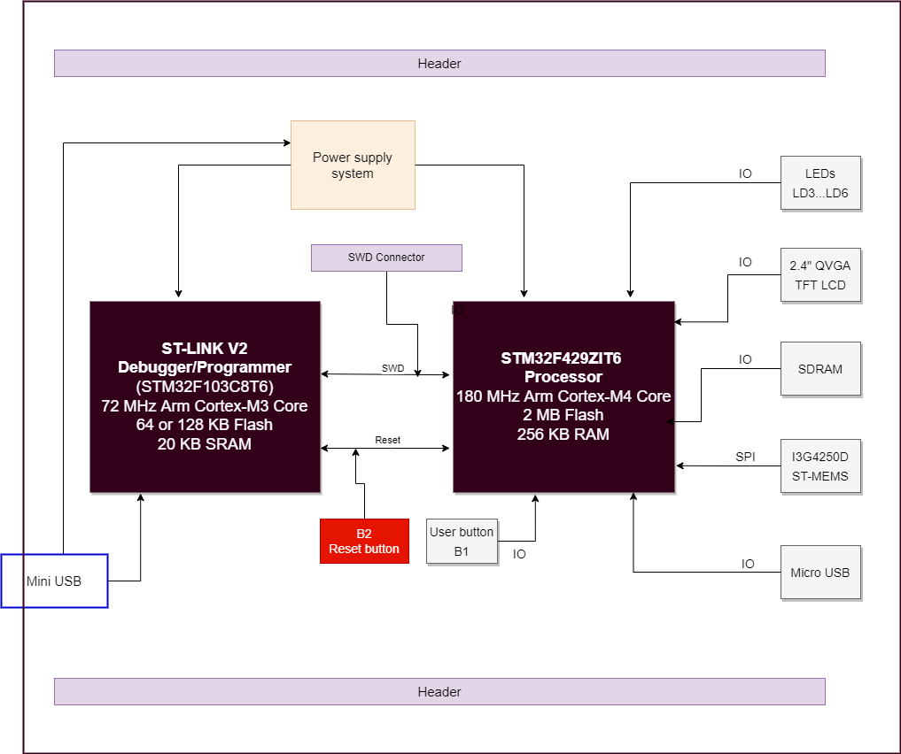
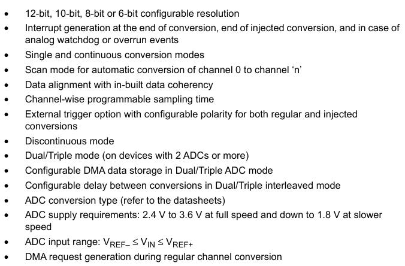

# Week 2 Exercise: Investigate Project Boards
1. Investigate the board intended for your final project. 
2. Investigate the board assigned to you. 

For each board, look at the datasheet and getting started information for the board. 
Draw the hardware block diagram for the board.

## 32F429IDISCOVERY

### Dev board: Hardware block diagram

For peripherals, note the communication paths (SPI, I2C, etc).
### Dev board: Peripherals
|Peripheral      |Communication with MCU|
|:-------------|:--------------------------|
|Embedded ST-LINK/V2-B|    SWD|
|Push buttons (B1, B2)|    GPIO|
|LEDs|            GPIO|
|SDRAM|Flexible Memory Controller (FMC)         |
|Micro USB| USB_OTG_FS (on the go full speed)               |
|ST MEMS Gyroscope (I3G4250D)|    I2C/SPI|
|2.4" QVGA TFT LCD|       Parallel interface|

Look through the datasheet for the processor and other documents. Answer these questions: 
### Processor related:
* What kind of processor is it? 
    * STM32F429ZIT6

* How much Flash and RAM does it have? Any other memory types? 
    * 2MB Flash and 256KB RAM
    * 4KB backup SRAM

* Does it have any special peripherals? (List 3-5 that you find interesting).
    * ADC, DAC, CAN, TIMERS, USART, SDIO, SAI, DCMI 

* If it has an ADC, what are the features?
### ADC features
  
[Courtesy: ST](st.com)

##### Board cost
STM32F429I-DISC1: **$29.90** (Digikey).  
**Stock available at various vendors around.**

##### Processor cost
USB to Serial processor ((CY8C5868LTI-LP039)): **$24.31** (Digikey).  
Main core (CY8C4014LQI-422): **$3.03** (Digikey).  
**Both the processors are out of stock all over.**