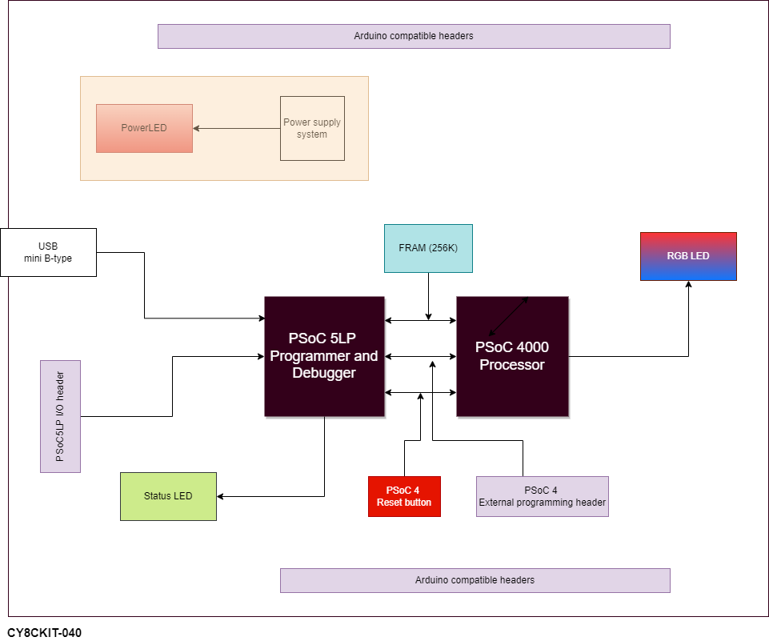

# Week 2 Exercise: Investigate Project Boards
1. Investigate the board intended for your final project. 
2. Investigate the board assigned to you. 

For each board, look at the datasheet and getting started information for the board. 
Draw the hardware block diagram for the board.

## CY8CKIT-040

### Dev board: Hardware block diagram

For peripherals, note the communication paths (SPI, I2C, etc).
### Dev board: Peripherals
|Peripheral      |Communication with MCU|
|:-------------|:--------------------------|
|PSoC 5LP Debugger/Programmer|    SWD|
|Reset button|    GPIO|
|Status/Power LEDs|            GPIO|
|F-RAM (256 KB)|   I2C      |
|RGB LED|     GPIO          |

Look through the datasheet for the processor and other documents. Answer these questions: 
### Processor related:
* What kind of processor is it? 
    * CY8C4014LQI-422

* How much Flash and RAM does it have? Any other memory types? 
    * 16 KB of flash
    * 2 KB of SRAM
    * 4 KB of SROM (A supervisory ROM that contains boot and configuration routines
        is provided.)

* Does it have any special peripherals? (List 3-5 that you find interesting.
    * FRAM, PSoC 5LP debugger/Programmer, RGB Led, Proximity header

* If it has an ADC, what are the features?
### ADC
##### General Description:
The CSD Hardware ADC component repurposes the CAPSENSE™ CSD hardware to perform voltage measurements. At its core, the CSD hardware operates as a current sensing circuit. A 1 MΩ resistor placed in series with the input converts an input voltage signal into a small current which is measured by the CSD hardware. The input voltage is calculated from this measured current and reported through an Application Programming Interface (API).

After each device reset, a simple open circuit calibration must be performed before any measurements are taken. This calibration requires starting the ADC, disconnecting all inputs using the analog mux, and making a single API call. The open circuit calibration can be called again at any time to ensure that the result is as accurate as possible. The ADC supports multiplexing input channels and two schematic macros are provided in the library to demonstrate this ability.

This component is only available when not using the CAPSENSE™ CSD block (CAPSENSE™ cannot be placed in the design).

##### ADC Features
* 0 to 5 volt input range
* Results provided in mV
* End of Conversion (EOC) terminal provided for an optional interrupt

[Courtesy: Infineon](https://www.infineon.com/cms/en/design-support/tools/sdk/psoc-software/psoc-4-components/psoc-4-voltage-adc-using-csd-hardware-csd-adc-version-1.0/?utm_source=cypress&utm_medium=referral&utm_campaign=202110_globe_en_all_integration-component_datasheet)