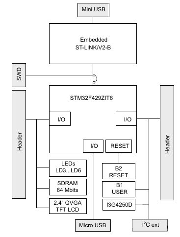

# Week 2 Exercise: Investigate Project Boards
1. Investigate the board intended for your final project. 
2. Investigate the board assigned to you. 

For each board, look at the datasheet and getting started information for the board. 
Draw the hardware block diagram for the board.

For peripherals, note the communication paths (SPI, I2C, etc).
|Peripheral      |Communication with MCU|
|:-------------|:--------------------------|
ST-LINK/V2-B|    JTAG|
Push buttons (B1 and B2)|    GPIO|
LEDs|            GPIO|
USB- OTG|               |
ST MEMS Gyroscope (I3G4250D)    I2C/SPI|
|2.4" QVGA TFT LCD|       Parallel interface|
