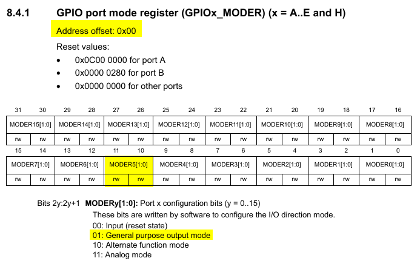

# Week 3 Exercise: Make Blinky
## NUCLEO F401RE
### Dev board: Hardware block diagram

**1. What build environment are you using?**  
    STM32CubeIDE  
**2. Can you step through the code to see what each line does?**  
    Yes, in debugger perspective of IDE

**3. What are the hardware registers that cause the LED to turn on and off? (From the processor manual, don’t worry about initialization.)**  
     
   Mode register sets the direction of the pin  
   Set the port pin for Led as Output. (Led is connected to GPIOA Pin 5 on Nucleo F401RE board)  
   Set the port pin for user button as Input. (User button is connected to GPIOC Pin 13 on Nucleo F401RE board)  
   These pins can be accessed via memory mapped IO.  
   To set the mode for the pin to which led is connected, first get its location in the memory map by adding the base address of GPIOA with GPIOx_MODER offset address.  

   Base address of GPIOA:            0x40020000U  
   Offset address of GPIOx_MODER:    0x0U  
        uint32_t* const pGpioAModeReg = (uint32_t*) (0x40020000U + 0x0U);  
   * PA5 (Led) can now be set as output (as shown in the above image of GPIOx_MODER)  
        *pGpioAModeReg |= (1<<10);	//set bit 10  
        *pGpioAModeReg &= ~(1<<11); 	//clear bit 11  

   Base address of GPIOC:            0x40020800U  
   Offset address of GPIOx_MODER:    0x0U  
        uint32_t* const pGpioCModeReg = (uint32_t*) (0x40020800U + 0x0U);  
   * PC13 (button) can now be set as input (as shown in the above image of GPIOx_MODER)  
        *pGpioCModeReg &= ~(3<<27); 		//clear bits 27, 26

     
   Writing 1/0 to output data register changes the voltage level on the respective pin mapped to it.  
   To turn the Led On, write 1 to GPIOA pin 5 of ODR  
   To turn the Led Off, write 0 to GPIOA pin 5 of ODR  
   Base address of GPIOA:            0x40020000U  
   Offset address of GPIOx_ODR:    0x14U  
   uint32_t* const pGpioAOdrReg = (uint32_t*) (0x40020000U + 0x14U);  
   
        //Set PA5 (turn on led)  
        *pGpioAOdrReg  |= (1<<5);

        //Clear PA5 (turn off led)
        *pGpioAOdrReg  &= ~(1<<5);

**4. What are the registers that you read in order to find out the state of the button?**  
     

**5. Can you read the register directly and see the button change in a debugger or by printing out the value of the memory at the register’s address?**  
     

   

### Implementation
#### Add a button to turn the LED on and off. 
#### Button causes an interrupt. 
#### Debounce the button signal.
